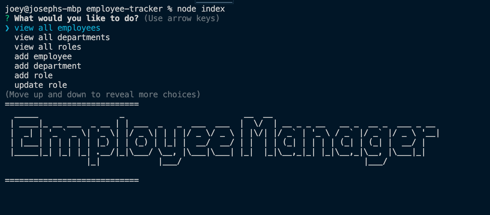

# Employee Tracker

  ## Description

  The employee tracker is a command line application that is used to keep track of employees within a company. This trackers keeps track of employees, their role in the company, the department they work in, and the amount of money they make in that position. In addition to keeping track of all these things, the tracker also allows the user to add departments, roles, and employees. It also allows the user to delete an employee and update an employees role based off the role ID's. The employee tracker is a great way to keep track off all employees and get the most basic information about them. This tracker runs using inquirer and mysql. The employee tracker was super fun to make and didnt present too much of a challenge for me. I find mysql and inquirer to be very straight forward. I chose to add figlet to create a welcoming text animation when the application is run. If I had more time I would add a delete role and delete department function.
  

  ## Table of Contents

  *[installation](#installation)

  *[usage](#usage)

  *[contributing](#contributing)

  *[questions](#questions)

  *[license](#license)

  *[test](#test)

  ## Installation

  To install necessary dependencies, run the following command: undefined

  ## Usage

  Run node index.js in the terminal to run this application. 

  ## Contributing 
  Joseph Meus

  ## License
    
      This Project is licensed under the MIT

  ## Tests 

  To run tests, run the following command:
  npm

  ## Questions 

  If you have any questions, feel free to contact me at meusjoseph21@gmail.com. 

  More of my work can be found at [meusjoseph21](https://github/com/meusjoseph21)

  Github repository: https://github.com/meusjoseph21/employee-tracker

  Live Video of usage: 

  Image example: 

  

